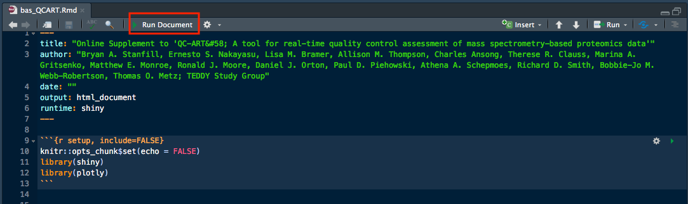

# QC-ART Web App
This repo contains all of the R code needed to create and run the QC-ART web app at https://ascm.shinyapps.io/bas_QCART/.

To run the app, open the `bas_QCART.Rmd` file using [R Studio](https://www.rstudio.com), which can be downloaded for free.  Once the appropriate libraries are installed (`shiny`, `knitr` to name two), click the "Run Document" button highlighted in the figure below.

<figure>

</figure>
